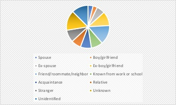

  

  

     

  <em class="center">Statistics provided by U.S. Bureau of Statistics</em>

  <h2>Cyber Stalking has been a major downside of social media, especially for females and college students. The following statistics speak for itself:</h2>
    <h3>
      - Almost <strong>1/3</strong> of undergraduate students reported experiencing some form of computer-based harassment. 
      - <strong>26%</strong> of women have been stalked online, compared to 8 percent of men. 
      - <strong>25%</strong>of women have been sexually harassed online, compared to 6 percent of men. 
      - <strong>23%</strong> of women have been physically threatened online, compared to 8 percent of men. 
      - <strong>18%</strong> of women have experienced sustained harassment online, compared to 7 percent of men. 
    </h3>

  <h2>Cyber stalking has also led to the increase in number of femicides and computer-based harassment:</h2>
    <h3>
      - <strong>76%</strong> of intimate partner femicide victims have been stalked by their intimate partner. 
      - <strong>89% </strong> of femicide victims who had been physically assaulted had also been stalked in the 12 months before their murder 
      - <strong>1 in 7 </strong> stalking victims have to move to escape from the abuser in the end. 
      - <strong> 1 in 25 </strong> Americans has been the victim of revenge porn. 
      - <strong> 10% </strong> of women under 30 have experienced threats to share images nonconsensually. 
      </h3>
<em>Information provided by Stalking Resource Center</em>

